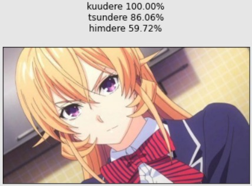
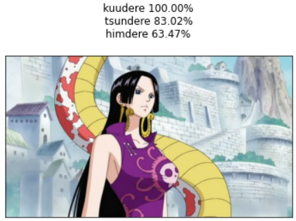
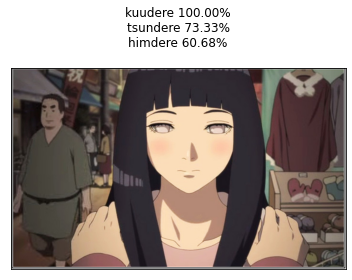
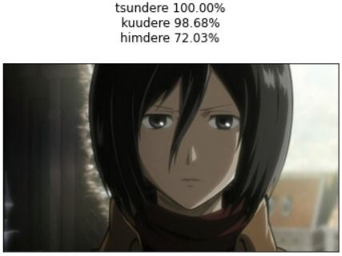
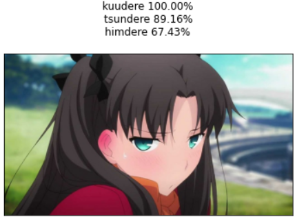
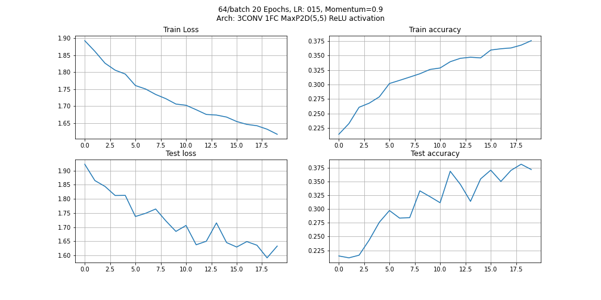
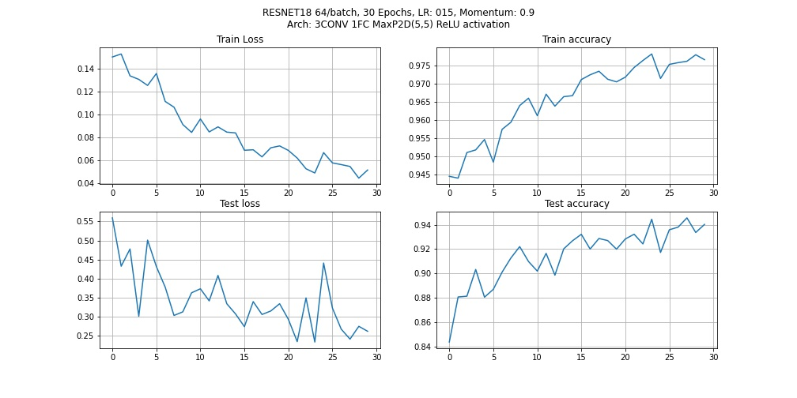

# Dere-Net
A classifier that classifies persona (dere) of waifus using deep neural netowrks

But what are Dere types? Check this dere chart

So obviously you must be thinking, how can a neural network classify the persona based on the images? Well it doesn't give proper results. So keeping that in mind, I just used this dataset to learn more about CNNs and Deep learning :)

But the [dataset](https://www.kaggle.com/jahelsantiagoleon/female-anime-characters-anime-dataset) had only 7 Deres, them being:
- Dandere
- Himedere
- Yangire
- Tsundere
- Kuudere
- Deredere
- Yandere

Here are some predictions from [colab](https://colab.research.google.com/github/insaiyancvk/Dere-Net/blob/main/Dere_net_colab.ipynb) (if you watched the anime that these characters belong to, then you'll know the correct dere):

TODO:
- Use gradio and make a web UI.
- Host it on heroku.

[TL;DR](https://github.com/insaiyancvk/Dere-Net/blob/main/updates.md)

My Model's best performance:

ResNet18's performance on same dataset:

