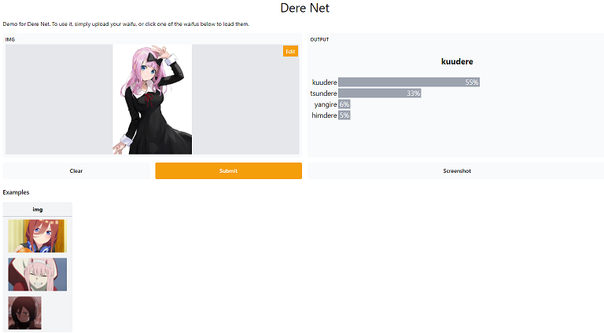
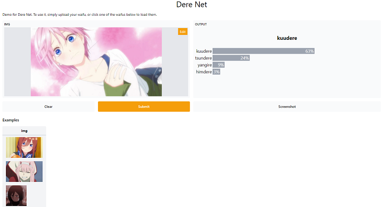

# Dere Net

A classifier that classifies persona (dere) of waifus using deep neural netowrks.

Here are some classifications on my waifus from the [app](https://derenet.herokuapp.com)

---

## But what are Dere types? Check this dere chart

So you must be thinking, how can a neural network classify a persona based on the images? Well it doesn't give exact results, just play around it's fun :). And keeping that in mind, I used this dataset to learn more about CNNs and Deep learning with PyTorch :)

But the [dataset](https://www.kaggle.com/jahelsantiagoleon/female-anime-characters-anime-dataset) had only 7 Deres, them being:
- Dandere
- Himedere
- Yangire
- Tsundere
- Kuudere
- Deredere
- Yandere

[TL;DR](https://github.com/insaiyancvk/Dere-Net/blob/main/updates.md)

My Model's best performance:

ResNet18's performance on the dataset:

