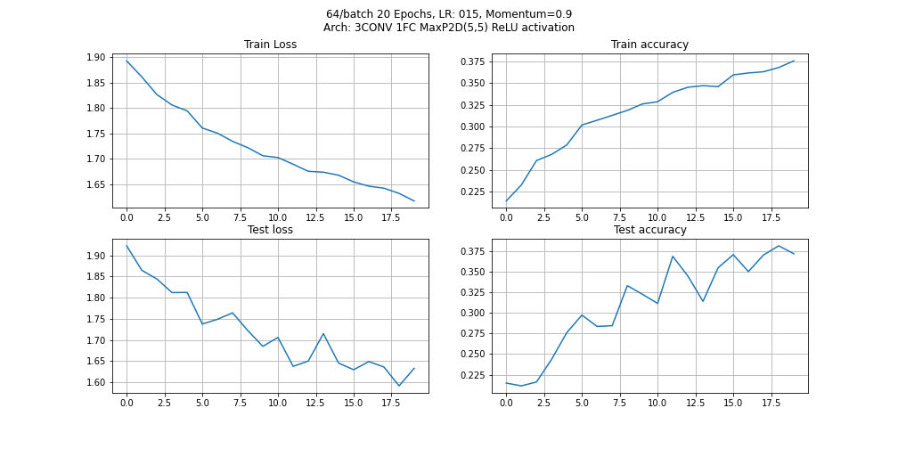

A whole lotta stuff happened since the last week (20 july 2021) when I started my "real" journey with CNNs and ANNs. 
I'll be listing what all I worked on.
 
1. Setup workspace.
    - Conda and the environment.
    - PyTorch, TorchVision, etc (the G) on local machine with GPU access (them cuda>>>>).
    - Other tools like jupyter notebook, numpy, kaggle-cli, cv2, matplotlib and other tools on the go.
2. Get the data. From where? Kaggle ofc. So my first hurdle was getting the data. Initially I wanted to do everything on my laptop's GPU itself (weird fantasies ig :p).
3. **A problem** came up. What should I do next? Define the NN? Resize the images? Plot the train data? Watch anime? Watch waifus? I didn't know. So what I did was, google "how to do an end to end deep learning project in torch". None of the search results gave me a proper explaination on what to work on. So it was at this moment when I thought I should contact experienced people. So I went ahead and called up my classmate who did GSoC with InCF (some stuff related to Deep learning, so yeah). [@Mainak](https://github.com/MainakDeb): my senpai. He came in Google Meet, stayed for about 3 hours then [@Mayukh](https://github.com/MayukhDeb) stayed for about an hour and taught me **A LOT**. So right now I have a clear idea of the whole process. Here it is:
    - Define all the [@transformations](https://pytorch.org/vision/stable/transforms.html#torchvision.transforms.Compose) you want to do on the images. For example, what I used were:
        - For training dataset:
            - Resize to 256x256
            - Random horizontal flip
            - Random vertical flip
            - Random brightness
            - Random rotation (-180 to 180)
            - Numpy array to Tensor
            - Normalize all pixel values with a mean and SD of 0.5 for RGB channels.
        - For test dataset:
            - Resize to 256x256
            - Numpy array to Tensor
            - Normalize all pixel values with a mean and SD of 0.6 for RGB channels
    - Move the datasets to [ImageFolder](https://pytorch.org/vision/stable/datasets.html#torchvision.datasets.ImageFolder) and pass the transforms pipeline to the function.
    - Create dataloader with whatever batch size you want and if you wanna shuffle or not. 
    - Define the NN.
        - I started with a very simple architecture consisting of 3 conv layers and 1 FC layer with ReLU activation and MaxPool for pooling.
    - Define the epoch function.
        - This step is probably what I call as the "heart" of the entire deep learning. That's because gradient calculations, backpropagation, optimization aka updation of weights happens here.
        - Later it's necessary to calculate the loss and accuracy of train and testing to asses the performance of the network.
    - Later you also need to collect the loss and accuracy values and plot them for all the epochs so that depending on the performance we can fine tune the hyper parameters like Learning Rate, Momentum, batch size, more transformations to data and finally the NN architecture itself if needed.
4. So after experimenting with LR, batch size, momentum, filters, epochs and the architecture itself, here are some graphs of loss and accuracy that I saved after each experiment. Here is the best one of all

5. As of right now, I decided to use ResNet-18 and it's other variants since it is one of the best architectures trained on ImageNet so it should do good and hence expecting an improvement in performance.

6. Okay so yesterday (1 Aug 2021) night I trained ResNet18 on the waifu dataset, and here are the results.

